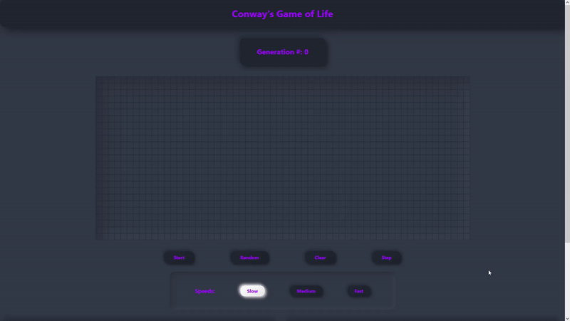
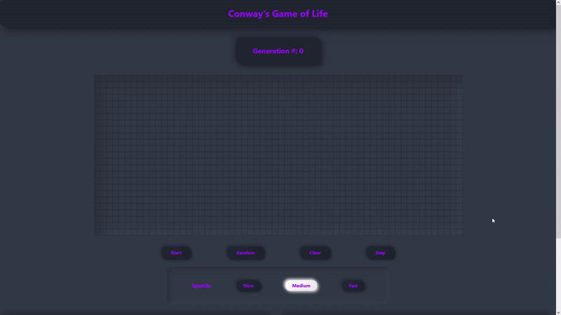

## Conway's Game Of Life
Created using React! 
This is a game originally made by John Horton Conway. It is a zero player game where you simply put initial input, hit start and observe. It is supposed to mimic life and its randomness. Some patterns remain still, some repeat endlessly, and others eventually end. Each cell(or square) follow these three rules:

* Any live cell with two or three live neighbours survives.
* Any dead cell with three live neighbours becomes a live cell.
* All other live cells die in the next generation. Similarly, all other dead cells stay dead.

## How to play
To start, simply select your preferred speed. Then hit **Random** and then **Start**. You can also clear(**Clear**) the Canvas or you can go step by step(**Step**). Example below.  
  
  
  
## Create Your Own
You can make your own patterns by clicking the squares. Example below.  
  
  
